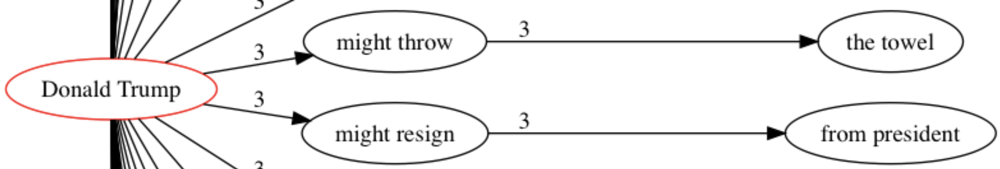
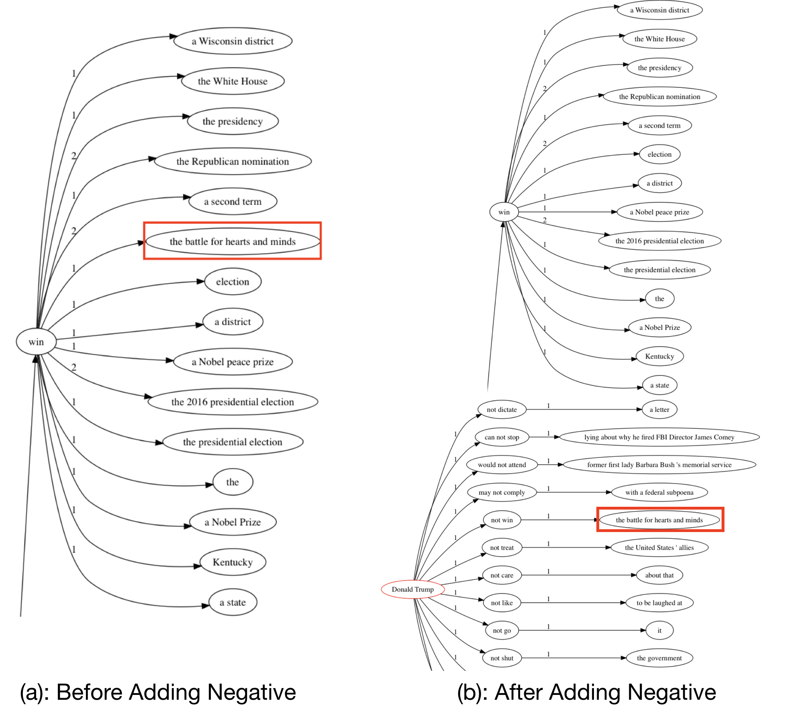
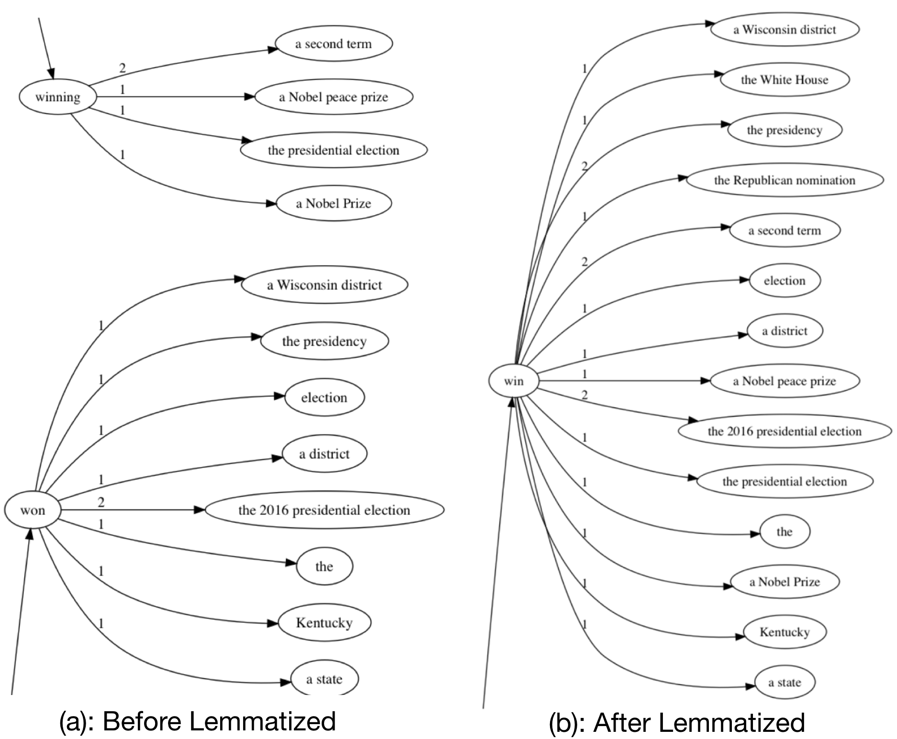

# Visualizing-Trend-of-Key-Roles-in-News-Articles

#### Demo: [here]( https://youtu.be/Xf_2eaSjq5w)

## Dataset

The 2 news datasets we are using is from Taboola company. One is a topic specific Trump dataset containing more than two months of news from late April to early July 2018. The news in this dataset share the same character, which is they all involve President Trump. The other dataset is general 6 months news data from November 2018 to April 2019. The topic of 6 months dataset ranges from sports to politics, food recipes to crime. Detailed format of the two datasets is as follows. 

#### Trump dataset

The Trump dataset has overall 20,833 news entries. Each news entry contains title description with punctuations, a unique article id, and probability on ten topic clusters clustered by latent dirichlet allocation (LDA), which is a three-level hierarchical Bayesian model where each item of a collection is modeled as a finite mixture over an underlying set of topics [LDA](http://www.jmlr.org/papers/volume3/blei03a/blei03a.pdf).

|     attribute     |           description            |
| :---------------: | :------------------------------: |
| title description | title description for each news  |
|    article ids    | unique article ids for each news |
|    probability    |  probability on topic clusters   |

​							Table1: Data Format of Trump Dataset

#### 6 Month Dataset

The 6 month dataset contains over half a million news title descriptions from the Taboola company. The 6 month dataset has two different formats, StepContent and StepIndexingData. They are both in json format but differ in attributes. 

##### StepContent Format

The StepContent format for the 6 months dataset includes taxonomy, first level taxonomy, unique article ids, title description, and so on. StepCotent uniquely contains title descriptions for later natural language processing. This special attribute is bolded in the table below. 

|       attribute       |               description               |
| :-------------------: | :-------------------------------------: |
|      articleIds       |    unique article ids for each news     |
|  firstLevelTaxonomy   |          first level category           |
|       taxonomy        |      multiple detailed categories       |
|         title         |               news title                |
| **title description** | **title description with punctuations** |
|          ...          |                   ...                   |

​						Table2: StepContent Format of 6 Month Dataset

**StepIndexingData** **Format**

 StepIndexingData also shares attributes that the StepContent format has, like taxonomy, unique article id, title and so on. This format has uniquely hierarchical topic cluster information including cluster id, label, labelScore, taxonomy as well as topTerms for level 0 to level 4 where level 0 indicates the most general topic clusters and level 4 indicates the most specific level. This information is bolded in the following table.

|     attribute      |                         description                          |
| :----------------: | :----------------------------------------------------------: |
|     articleIds     |               unique article ids for each news               |
| firstLevelTaxonomy |                     first level category                     |
|      taxonomy      |                 multiple detailed categories                 |
|       title        |                          news title                          |
|      traffic       |                traffic for this news article                 |
| **topic cluster**  | **contains id, label, labelScore, taxonomy, topTerms, topTermsScore** |
|        ...         |                             ...                              |

​				Table3: StepIndexingData Format of 6 Months Dataset

## How we deal with modifier, negative and perform lemmatization

Besides semantic roles like subject, verb and object, which are discussed in details in the demo paper,  other roles including modifier, negative, location play important roles in understanding the news as well. Some of them can even change the meaning of the news. How to deal with these vital roles is a challenge in the forest graph generated by semantic role labeling and coreference resolution.

#### Modifier Slightly Changes the Meaning of A Sentence

Previously before taking modifier into consideration, the only known information through subject and verb is that a certain subject performs certain action. However, there exist several possible ways of taking this action. They may intend to take the steps, have already conducted the behavior or just claim there is no possibility of doing that. This uncertainty is measured by modifier. In the figure below, by adding modifier, instead of the old news *Donald Trump **resign** from president*, which is not true for sure in year 2019, a completely different news saying *Donald Trump **might** **resign** from president* becomes more authentic for a news of 2019. 

Fig1: Add Modifier to Verbs

#### Negative Preserves Sentiment of the News

To preserve the correctness of the sentiment the news convey, negative role is added to the verb as an extra sentiment information. In the figure below, the left subgraph shows that, before adding negative roles, it is misleading to see *Donald Trump **win** the battle for hearts and minds*. Actually, the real key sentence in the news is in the right subgraph: *Donald Trump **not win** the battle for hearts and minds*.

Fig2: Result before and After Adding Negative Role

#### An option: Lemmatized Verbs

Lemmatization focuses on verbs with tense like *winning* and *won*, which they share the same stem. Merging them together using the lemmatized result can merge the duplicate information together to some extent. Here with $TF-IDF$ approach, objects *presidential* *election* and *the 2016 presidential election* together are merged in the figure below.

Fig3: Result before and After Lemmatized Verbs

One shortback of lemmatization is that lemmatized verbs lose information of tense. According to the lemmatized result (b) in Figure 3, we lost the information of whether the subject is winning or has already won the election. Therefore whether lemmatize a verb or not remains an option in the configuration for users to decide according to different circumstances.